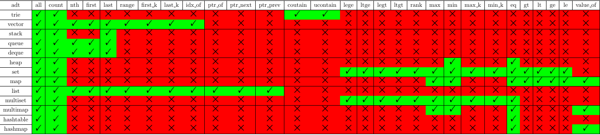
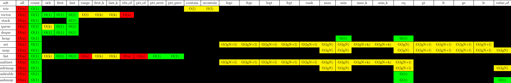
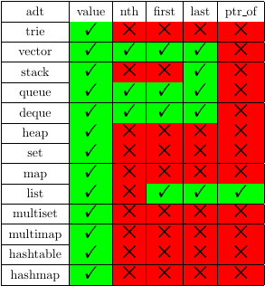
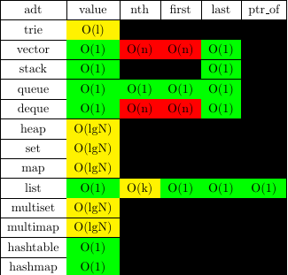
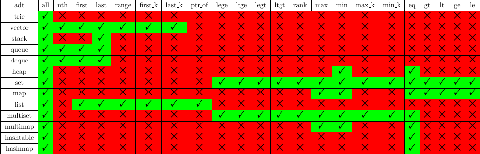
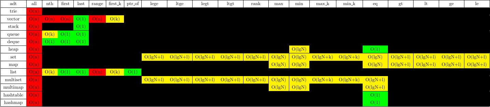
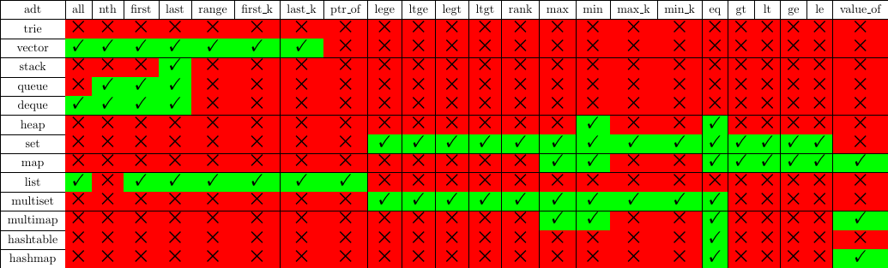
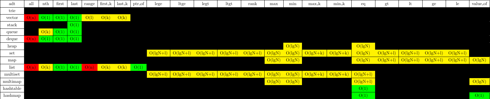

# This is nosql's document of shucantech company

## key values struct

the shucantech nosql database is a ADT memory database.it store as key and values.

the key values struct assumpt a key(as a integer) with a struct(container).

the key can fetch from a name(support C++ \n,\x,\u,\U) which specify when create.

every struct is a container of basic elements.

### the basic elements

i08/u08/i16/u16/i32/u32/i64/u64/float/double/string/date/date_time

### the container structs

trie/vector/stack/queue/deque/heap/set/map/list/multiset/multimap/hashtable/hashmap

### key's command

the key and struct you can use the followed command.

kvs                                                                       display all key's information

kvs  key                                                              display only matched key's information

erase key                                                              erase matched key, or return failed

clear                                                                 clear all keys

create contain_type key_type [value_type] [param] [key_name]      create struct with key_name, value_type use for map type, param for hash

backup path                                                      backup all keys to path

restore path                                                      restore from path

the followed is some samples for key's command

    create trie    
    create trie "abc"    
    create vector u64    
    create stack i32    
    create queue string    
    create deque date    
    create heap double    
    create set float    
    create list string    
    create multiset int    
    create vector u64 "abc"    
    create stack i32 "abc"    
    create list string "abc"    
    create queue string "abc"    
    create deque date "abc"    
    create heap double "abc"    
    create bst float "abc"    
    create set float "abc"    
    create multiset int "abc"    
    create map int string    
    create multimap int string    
    create hashtable int 200    
    create map int string "abc"    
    create multimap int string "abc"    
    create hashtable int 200 "abc"    
    create hashmap int string 200    
    create hashmap string int 200 "abcd"    
    
    erase 11    
    erase "abc" 
    
    backup "aaa.nos"    
    restore "aaa.nos"

### data's operator

#### get

get's syntax: 

        get key/key_name operator

the operator support for different struct in the followed table

and the complexity is explain by the followed table

the followed is some samples for get's command

    get "abcd" all;    
    get 100 all    
    get 100 nth 10    
    get 100 ptr_of 123    
    get 100 idx_of 123    
    get 100 first    
    get 100 last    
    get 100 range 1 1000    
    get 100 first_k 200    
    get 100 last_k 200    
    get 100 lege 2 10    
    get 100 ltge 2 100    
    get 100 legt 2 100    
    get 100 ltgt 2 100    
    get 100 max    
    get 100 min    
    get 100 max_k 10    
    get 100 min_k 10    
    get 100 eq 1.1    
    get 100 gt 1.2    
    get 100 lt 1.5    
    get 100 ge 2.0    
    get 100 le 3.0    
    get 100 rank 1.11
    get 100 contain "abc"
    get 100 ucontain "abcd"
    get 100 ptr_of 32
    get 100 ptr_next 120234002
    get 100 value_of "abc"

#### ins

ins's syntax: 

              ins key/key_name value    
              ins key/key_name operator

the operator only nth, first, last, ptr_of

the operator support for different struct in the followed table

and the complexity is explain by the followed table

the followed is some samples for ins's command

            ins 100 999  
            ins 100 nth 10 999  
            ins 100 first 999  
            ins 100 last 99  
            ins 100 ptr_of 0x10000000  
            ins 100 200 300  
            
            

#### del

del's syntax: 

              del key/key_name operator

the operator support for different struct in the followed table

and the complexity is explain by the followed table

the followed is some samples for del's command

    del 100 all
    del 100 nth 10
    del 100 first
    del 100 last
    del 100 range 1 1000
    del 100 first_k 200
    del 100 last_k 200
    del 100 lege 2 10
    del 100 ltge 2 100
    del 100 legt 2 100
    del 100 ltgt 2 100
    del 100 max
    del 100 min
    del 100 max_k 10
    del 100 min_k 10
    del 100 eq 1.1
    del 100 gt 1.2
    del 100 lt 1.5
    del 100 ge 2.0
    del 100 le 3.0

#### set

set's syntax: 

              set key/key_name operator value

the operator support for different struct in the followed table

and the complexity is explain by the followed table

the followed is some samples for set's command

    set 100 all 999
    set 100 nth 10 999
    set 100 first 999
    set 100 last 999
    set 100 range 1 1000 999
    set 100 first_k 200 999
    set 100 last_k 200 999
    set 100 lege 2 10 999
    set 100 ltge 2 100 999
    set 100 legt 2 100 999
    set 100 ltgt 2 100 999
    set 100 max 999
    set 100 min 999
    set 100 max_k 10 999
    set 100 min_k 10 999
    set 100 eq 1.1 999
    set 100 gt 1.2 999
    set 100 lt 1.5 999
    set 100 ge 2.0 999
    set 100 le 3.0 999

#### sdk

in the directory sdk there is sample for c and python, you can use it as basic example.

#### license

the shucantech nosql database is free for use. you can download from http://www.shucantech.com/en/trial.html

or

http://www.shucantech.com/zh/trial.html

and this document is in public domain.
